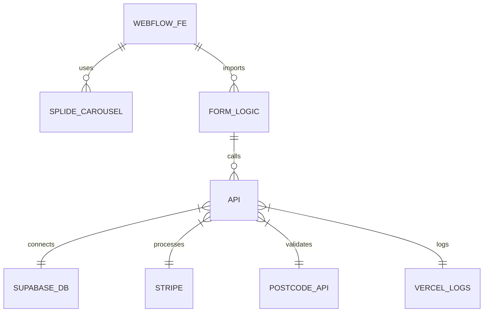
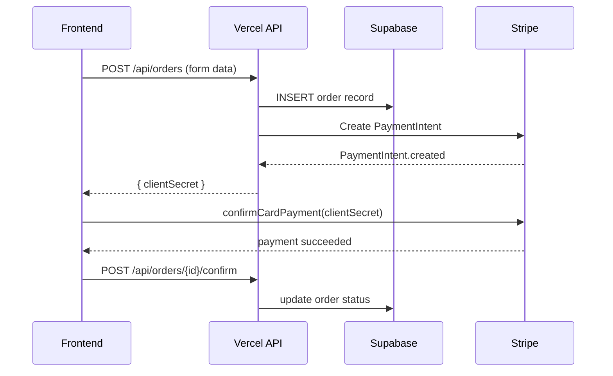

---

title: "Architecture Overview"
description: "High-level systeemarchitectuur van het Heppy Schoonmaak-platform"
date: 2025-05-15
----------------

# Architecture Overview

## 🎛️ Systeemcomponenten

* **Frontend (Webflow)**

  * HTML & CSS gegenereerd door Webflow
  * Vanilla JavaScript modules voor formulierlogica, validatie, UI-updates en Splide multi-step carrousel
  * Gehost op Vercel, served via edge

* **API-laag (Vercel Functions)**

  * Alle endpoints in `/api`-map met Vanilla JS
  * Handlers voor:

    * Adresvalidatie (PostcodeAPI)
    * Coverage-check (Supabase)
    * Aanvraagverwerking (Supabase)
    * Betalingen (Stripe Webhooks & API)
  * Logging naar Vercel Logs

* **Database & Auth (Supabase)**

  * PostgreSQL voor opslag van gebruikers, aanvragen, dekkingstabellen, configuratie
  * Supabase Auth voor gebruikersbeheer en tokens

* **Externe Integraties**

  * **PostcodeAPI**: valideert NL-adres (GET requests)
  * **Stripe**: PaymentIntent flow voor eenmalige & abonnementen
  * **E-mail provider** (optioneel): notificaties via transactional e-mails

* **Monitoring & Logging**

  * **Frontend**: `console` logs voor fouten en states
  * **Backend**: Vercel Logs (JSON via logger-wrapper)
  * **Ops**: Alerts op ERROR/CRITICAL niveaus in Vercel Dashboard

## 🔄 Dataflows

### 1. Adrescheck & Coverage

1. Bezoeker vult formulier in → frontend validatie
2. Frontend `fetch('/api/coverage', { postcode, number })`
3. API-call: controle in Supabase (`coverage` tabel)
4. API retourneert `{ coverage: boolean }`
5. Frontend navigeert naar juiste slide of pagina

### 2. Aanvraag & Betaling

---

*Dit overzicht geeft een beknopt beeld van hoe de componenten samenwerken. Voor details zie individuele documentatie in `/docs/project/` en `/docs/guidelines/`.*
